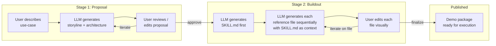
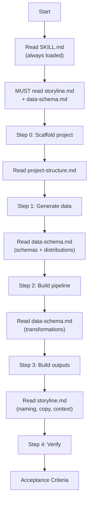

# Demo Package Architecture

## Design Principles

Five principles that shape every decision in this architecture:

**1. Sequential generation for consistency.** Stage 2 does NOT generate all files in one LLM call. It generates SKILL.md first, then uses SKILL.md as context to generate each reference file in a separate call. More calls, but each is focused and consistent. Eliminates the drift problem where column names or table references diverge across files.

**2. Mandatory references, not suggestions.** The downstream LLM must not skip reference files. SKILL.md uses imperative language: "You MUST read data-schema.md before proceeding to Step 1." Modeled on `databricks-mlflow-evaluation` which opens with "1. Read GOTCHAS.md. 2. Read CRITICAL-interfaces.md." Every build step names the exact file(s) required.

**3. Phased implementation.** Phase 1 ships the proposal stage (Stage 1) without touching existing generation. Phase 2 adds multi-file buildout (Stage 2). The current single-SKILL.md flow continues to work throughout. Phase 3+ is documented at the bottom of this file.

**4. Visual-first curation UI.** Four files of raw markdown is a burden. The UI abstracts it: storyline renders as a narrative card, data-schema renders as interactive schema tables with a relationship diagram, project-structure renders as a file tree. The user edits through visual affordances, not by staring at markdown. Raw view is available but not the default.

**5. Canonical filenames, never renamed.** The package uses exactly four fixed filenames: `SKILL.md`, `storyline.md`, `data-schema.md`, `project-structure.md`. These are the universal convention. The UI never exposes rename. References never break because the names never change.

---

## Overview: The Staged Generation Pipeline

Progressive disclosure applies to the **generation process itself**, not just downstream consumption. Two stages:

- **Stage 1 (Proposal)**: User describes a use-case. LLM generates a lightweight **storyline blurb + component architecture**. Cheap to iterate -- no schemas, no steps, no layout.
- **Stage 2 (Buildout)**: User approves the proposal. LLM sequentially generates **SKILL.md first, then each reference file** using SKILL.md as context. The approved proposal seeds everything.

Editable at every point in both stages.



---

## Stage 1: The Proposal

### What the LLM generates

A single markdown document (~200-300 lines) with two parts:

**Part A -- Storyline Blurb** (~150 lines):

- Industry context (the landscape, trends, pressures)
- Company persona (fictional company, size, sector, current pain)
- Business problem (what's broken, what it costs them)
- Proposed solution narrative (the "before/after" arc)
- Wow moment (the single takeaway for the audience)
- Talking points / competitive positioning

**Part B -- Component Architecture** (~100 lines):

- Which Databricks components are involved and how they connect
- Structured so the existing `parseArchitecture` logic can build the visual
- Example: Auto Loader -> Bronze Tables -> SDP Pipeline -> Silver/Gold -> AI/BI Dashboard + Genie Space
- Data sources (synthetic, what domain)
- Key outputs (dashboards, Genie spaces, apps, models)

The architecture section is intentionally structured as markdown that the current frontend architecture visualization can parse. The user gets an immediate visual of the Databricks component layout.

### Why this is Stage 1

- **Cheap to iterate**: No schemas, no build steps, no project layout. "Actually make it about supply chain not retail" is a fast, cheap regeneration.
- **Locks the direction**: Once approved, Stage 2 has clear constraints. The LLM doesn't improvise.
- **Human curation matters most here**: The storyline is where domain expertise lives.

### How the UI presents Stage 1

Not a wall of markdown. The UI renders:

- A **narrative card** with the storyline blurb (formatted prose, not raw markdown)
- The **architecture visualization** (the existing component diagram, parsed from Part B)
- A **chat sidebar** for refinement ("make the persona a Fortune 500", "add Vector Search")
- An **Approve** button that locks the proposal and triggers Stage 2

The user can also toggle to raw markdown for direct editing.

---

## Stage 2: The Buildout

### Sequential generation (Principle 1)

The buildout does NOT produce all files in one LLM call. The sequence:

1. **Generate SKILL.md** -- using the approved proposal as context. This establishes the authoritative build steps, table names, output descriptions, and file references.
2. **Generate storyline.md** -- using the proposal + SKILL.md as context. Expands the narrative with domain detail informed by the now-defined scope.
3. **Generate data-schema.md** -- using SKILL.md as context (specifically the Datasets/Outputs sections). Produces exact schemas that match what SKILL.md references.
4. **Generate project-structure.md** -- using SKILL.md as context (specifically the Build Steps and Outputs). Produces a directory layout that matches the deliverables.

Each call is focused (~2K-4K output tokens) and consistent with what came before. The user sees each file appear in the UI as it's generated.

### The package (canonical filenames -- Principle 5)

```
<demo-name>/
├── SKILL.md                 # Router: overview, build steps, acceptance criteria
├── storyline.md             # Expanded business narrative
├── data-schema.md           # Table schemas, relationships, transformations
└── project-structure.md     # Target directory layout, setup sequence
```

These four filenames are fixed. The UI never exposes rename. Every reference in SKILL.md uses these exact names.

### SKILL.md -- The Router (~150-200 lines)

**Always loaded by the downstream LLM.** Uses mandatory language (Principle 2).

- YAML frontmatter (name, description)
- Overview (1 paragraph)
- Prerequisites (catalog, schema, workspace)
- **Mandatory First Reads** section:

```markdown
## Before You Start

You MUST read these files before proceeding:
1. Read [storyline.md](storyline.md) to understand the business context and demo narrative.
2. Read [data-schema.md](data-schema.md) to understand all table schemas and relationships.
```

- Outputs (one subsection per deliverable)
- Build Steps (numbered checklist, each naming the exact ai-dev-kit skill AND reference file):

```markdown
### Step 1: Generate Synthetic Data

You MUST read [data-schema.md](data-schema.md) for exact table schemas before generating data.
Read the `databricks-synthetic-data-generation` skill and use it to create these tables.
Use `execute_sql` to verify tables after creation.
```

- Acceptance Criteria
- Reference Files Quick Lookup

### storyline.md -- The Narrative (~100-200 lines)

Expanded from Stage 1 proposal. Industry context, company persona, narrative arc, wow moment, domain terminology.

### data-schema.md -- The Data Model (~150-300 lines)

The single source of truth for data. Per-table schemas, relationships, business rules, distribution hints, row counts, transformation logic (bronze -> silver -> gold).

### project-structure.md -- The Layout (~50-100 lines)

Target directory tree, file purposes, prerequisites, deployment notes.

### For Complex Demos: Optional deliverables.md

If outputs are complex (6-tab dashboard + Genie + APX app), split detailed specs into `deliverables.md` to keep SKILL.md under 200 lines.

---

## How the UI Abstracts Curation (Principle 4)

### Stage 2: Visual file views

Each file renders as a **visual card**, not raw markdown:

- **storyline.md** -> Narrative card with formatted prose sections (persona, pain point, wow moment as distinct visual blocks)
- **data-schema.md** -> Interactive schema tables (sortable columns, type badges) + a relationship diagram showing foreign keys and joins between tables
- **project-structure.md** -> File tree visualization (collapsible, with purpose tooltips)
- **SKILL.md** -> Checklist view (build steps as interactive checkboxes) + output cards

Each card has:

- An **edit** affordance (inline editing of the visual representation)
- A **chat** affordance (refine this specific file via conversation)
- A **raw** toggle (for power users who want to edit markdown directly)

This way, reviewing 4 files feels like reviewing 4 visual panels -- not reading 4 markdown documents.

---

## How the Downstream LLM Consumes the Package

Progressive disclosure means the downstream LLM never loads all files simultaneously:



---

## Implementation: Phased (Principle 3)

### Phase 1: Proposal Stage (ships independently)

This phase adds Stage 1 without touching existing generation. The current workspace flow continues to work.

**Backend** ([skill_generator.py](app/src/demo_prompt_generator/backend/services/skill_generator.py)):

- New `_build_proposal_system_prompt()` for storyline + architecture generation
- New `stream_proposal()` async generator (mirrors `stream_skill_from_topic()` pattern)
- Proposal refinement reuses existing chat-refinement pattern

**Data model** ([models.py](app/src/demo_prompt_generator/backend/models.py)):

- Add `stage: str` column (`"proposal"` or `"package"`) with default `"package"` for backward compat
- Add `proposal_md: Optional[str]` column

**API** ([workspace.py](app/src/demo_prompt_generator/backend/routes/workspace.py)):

- `POST /workspace/propose` -- streams proposal via SSE
- `POST /workspace/approve` -- marks proposal approved, transitions to Stage 2
- Existing `/workspace/generate` and `/workspace/refine` unchanged

**Frontend**:

- New Stage 1 view: narrative card + architecture visualization + chat + approve button
- Existing workspace view untouched (used as Stage 2 fallback until Phase 2)

### Phase 2: Multi-File Buildout

**Backend** ([skill_generator.py](app/src/demo_prompt_generator/backend/services/skill_generator.py)):

- New `_build_buildout_system_prompt()` for SKILL.md generation from approved proposal
- New `_build_reference_file_prompt(filename, skill_md, proposal_md)` for each reference file
- New `stream_buildout()` that sequentially generates SKILL.md, then storyline.md, data-schema.md, project-structure.md -- each as a separate LLM call with prior files as context
- New `stream_file_refinement()` for per-file chat refinement (sends target file + full package context)

**Data model**:

- Add `skill_files: Optional[str]` column (JSON dict mapping filename to content)
- Keep `skill_md` populated with SKILL.md content for backward compat

**API**:

- Update `/workspace/generate` to stream multi-file buildout with `type: "file_start"` / `type: "file_content"` SSE events
- Update `/workspace/refine` to accept optional `target_file` parameter
- Add `GET /workspace/{id}/download` returning a zip of the package directory

**Frontend**:

- File card views with visual rendering per file type (schema tables, file trees, narrative cards, checklists)
- Per-file edit (inline visual + raw toggle) and chat refinement
- Zip download button
- Architecture graph parses SKILL.md (same as current)

### Phase 3+: Future Roadmap

- **Demo Gallery**: Browse and fork published demo packages
- **Versioning**: Track revisions to each file in a package
- **Forking**: Clone a published package as a starting point, customize for a different account/industry
- **Execution tracking**: After a downstream LLM executes a package, track which steps succeeded/failed
- **Package validation**: Automated checks that references are consistent (every table in SKILL.md exists in data-schema.md, every file reference resolves)
- **Collaborative editing**: Multiple users curate the same package

---

## Key Design Decisions

- **Sequential generation prevents drift.** SKILL.md is generated first and becomes the source of truth. Each reference file is generated with SKILL.md in context, so column names, table references, and step numbering are consistent.
- **Mandatory references prevent skipping.** SKILL.md uses "You MUST read" language, not "See X for details." The downstream LLM treats reference files as prerequisites, not optional reading.
- **Phase 1 ships independently.** The proposal stage adds value immediately (faster iteration, better direction-setting) without requiring the multi-file buildout to be complete.
- **Visual UI reduces curation burden.** Users review narrative cards, schema tables, and file trees -- not raw markdown. The app does the mental load of rendering structure; the user focuses on content.
- **Canonical filenames never change.** `SKILL.md`, `storyline.md`, `data-schema.md`, `project-structure.md`. No renames, no broken references, no ambiguity.
- **`data-schema.md` is the single source of truth.** Transformations live here because they're inseparable from schemas. Follows `CRITICAL-interfaces.md` from `databricks-mlflow-evaluation`.
- **Backward compatible.** `skill_md` column persists. Existing single-file generations still work. Multi-file is additive.
