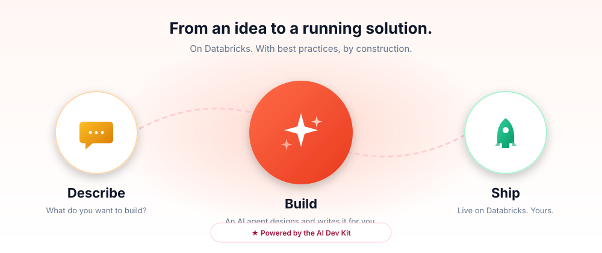
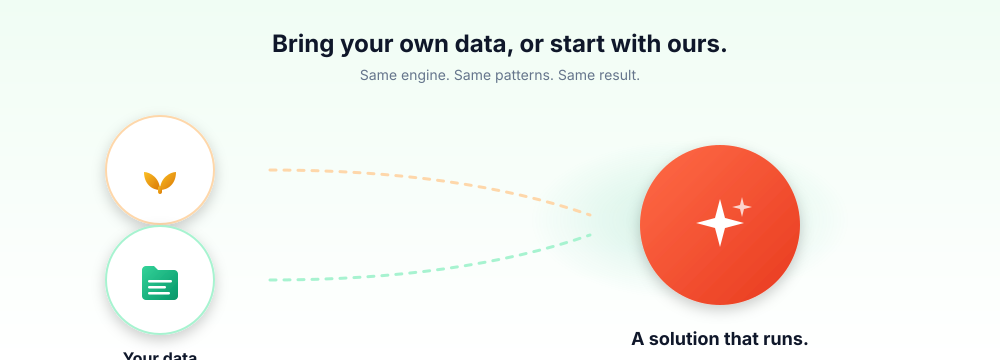
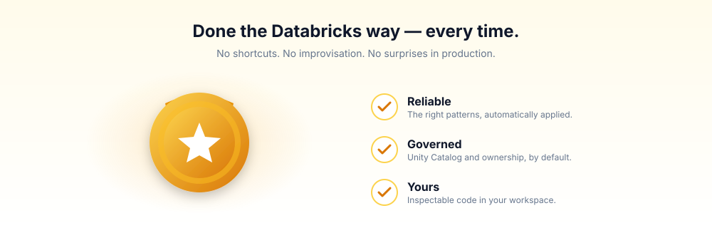

<p align="center">
  
</p>

<p align="center">
  
  
  
  
  
  
  
  
</p>

<h1 align="center">Databricks Solution Builder</h1>

<p align="center">
  <b>Build your use-case on Databricks — with the assurance you're using Databricks best practices.</b><br>
  <sub>On synthetic data, or on your own real data. Same engine. Same patterns.</sub>
</p>

<p align="center">
  
</p>

---

Describe what you want to build and an AI agent designs, writes, and ships it for you — on Databricks, the way Databricks intends. Customer-facing demo, internal POC, pilot on your own production data: same engine. Whether you start with synthetic data or point at your real tables, what comes out is a real, running solution in your workspace — yours to inspect, edit, and own.

> **In one line:** describe it, ship it, iterate on what actually matters.

> [!CAUTION]
> **Use at your own risk.** This is **vibecoding software** — an AI agent writing code and creating resources on your behalf. Expect occasional surprises; treat its output as a starting point.
>
> | 🛡️ &nbsp; What constrains it | ⚠️ &nbsp; What it won't catch |
> |---|---|
> | Your **Unity Catalog** permissions | Accidental deletes inside catalogs you own |
> | Your **workspace** entitlements | Runaway compute cost |
> | The app's **OAuth scopes** | Subtle correctness bugs in generated code |
>
> Review before applying changes. Use separate dev/prod catalogs. Software provided "as is" — see [LICENSE](LICENSE).

---

## 💡 Why you'll love it

### `01` &nbsp; Bring your own data, or start with ours

<p align="center">
  
</p>

Trying an idea? The agent fabricates realistic synthetic data and gives you something to click through in minutes. Bringing your own? Point at the tables you already have. **You don't switch tools when you graduate from sandbox to production** — same engine, same patterns, same result.

### `02` &nbsp; Done the Databricks way — every time

<p align="center">
  
</p>

No improvisation. No "I hope this is the right pattern." The agent works from a curated library and hands off to an interface that already knows the right way to do every Databricks thing. You can show the result to your customer on Monday with confidence.

### `03` &nbsp; Two surfaces, one library

Prefer your terminal? Install the [Demo Generator Skill](.claude/skills/databricks-demo-generator) into any Claude Code project and use it from the CLI. Want a guided UI with chat, file viewer, and live diagrams? Use this app. **Same library, same outputs, same deploys** — pick whichever surface fits the moment.

### `04` &nbsp; Reuse and remix

Every solution becomes context for the next. Reskin one industry for another; swap one pattern for a related one; recombine for a new pitch. Publish finished projects as templates that anyone in your org can fork from the gallery. The library compounds.

---

## 🚀 Quickstart (local dev)

```bash
# 1. Clone
git clone https://github.com/databricks-solutions/databricks-solution-builder.git
cd databricks-solution-builder/app

# 2. Authenticate the Databricks CLI (one-time)
databricks auth login --host https://<workspace-url> --profile MY_WORKSPACE

# 3. Configure env
cp .env.example .env
# edit .env → DATABRICKS_CONFIG_PROFILE=MY_WORKSPACE

# 4. Install deps
uv sync          # Python (creates .venv)
bun install      # Frontend

# 5. Run (backend :8000 + frontend :5173, hot reload, opens browser)
./scripts/dev.sh
```

PGLite auto-provisions a local Postgres — no DB setup required. Reset with `RESET_DB=1 ./scripts/dev.sh`.

**Prerequisites:** [`uv`](https://docs.astral.sh/uv/) · [`bun`](https://bun.sh/) · [Databricks CLI](https://docs.databricks.com/dev-tools/cli/index.html) v0.239.0+ authenticated to a workspace.

<details>
<summary><b>🔧 Environment variables — click to expand</b></summary>

<br>

All of these live in `app/.env` (copy from [`app/.env.example`](app/.env.example)). The bold ones are the minimum to boot.

| Variable | Required | Default | Purpose |
|----------|:---:|----------|---------|
| **`DATABRICKS_CONFIG_PROFILE`** | ✅ | `DEFAULT` | Profile from `~/.databrickscfg` (set via `databricks auth login`) |
| `DATABRICKS_HOST` / `DATABRICKS_TOKEN` | alt | — | Direct token auth (CI/CD); use *instead of* the profile |
| `LAKEBASE_DATABASE_PATH` | optional | — | `projects/<id>/branches/<id>/databases/<name>` — omit to use PGLite |
| `USE_PGLITE` | optional | — | Force PGLite even if `LAKEBASE_DATABASE_PATH` is set |
| **`ANTHROPIC_LLM_ENDPOINT`** | ✅ | `databricks-claude-sonnet-4-6` | Model the agent talks to (via FMAPI Anthropic bridge) |
| **`ANTHROPIC_BASE_PATH`** | ✅ | `serving-endpoints/anthropic` | FMAPI bridge path — switch to `ai-gateway/anthropic` for AI Gateway endpoints |
| **`AI_GATEWAY`** | ✅ | `databricks-claude-opus-4-7` | Primary AI Gateway endpoint for the backend |
| **`AI_GATEWAY_MINI`** | ✅ | `databricks-gpt-5-4-mini` | Cheap/fast endpoint for utility calls |
| **`AI_GATEWAY_EMBEDDING`** | ✅ | `databricks-qwen3-embedding-0-6b` | Embedding endpoint for template semantic search |
| `AI_DEV_KIT_BRANCH` | optional | `experimental` | Branch of [ai-dev-kit](https://github.com/databricks-solutions/ai-dev-kit) that `dev.sh` clones |
| `DEMO_PROMPT_GENERATOR_TRACKER_ENABLED` | optional | `1` | Anonymous usage analytics — see the privacy note below; set to `0` to opt out |

See [`app/.env.example`](app/.env.example) for the full annotated list with inline guidance.

> **📊 Anonymous usage analytics are on by default.**
> We collect aggregated, anonymized events (page views, feature usage counts) **only to understand what's working and what needs improvement** — never for sales contact. The underlying [`dbdemos-tracker`](https://pypi.org/project/dbdemos-tracker/) package filters at the source so events fire only for `@databricks.com` users; external installations send nothing. See [`PRIVACY.md`](PRIVACY.md) for the full list of fields. Opt out anytime with `DEMO_PROMPT_GENERATOR_TRACKER_ENABLED=0`.

</details>

**Type checking:**

```bash
cd app
npx tsc --noEmit          # TypeScript
uv run mypy src           # Python
```

---

## 🛠️ Three ways to run

| Mode | Where it runs | Auth model | Use case |
|------|---------------|------------|----------|
| **Local dev** | Your laptop | `~/.databrickscfg` profile | Day-to-day development with hot reload |
| **Databricks App** | A Databricks workspace | App service principal (OAuth) | Shared deployment for your team |
| **Electron** | Your laptop, packaged | `~/.databrickscfg` profile | Standalone desktop app for end-users |

<details>
<summary><b>📦 Deploy to Databricks (production) — click to expand</b></summary>

<br>

The app deploys as a [Databricks Asset Bundle](https://docs.databricks.com/dev-tools/bundles/index.html) — Lakebase database, App resource, model-serving permissions, and source code in one command.

```bash
cd app

# One-time setup
databricks auth login --host https://<workspace-url> --profile MY_WORKSPACE
cp databricks.prod.yml.example databricks.prod.yml
# fill in workspace.profile, variables, env

# Deploy
databricks bundle deploy
databricks bundle run demo-prompt-generator-app
```

`databricks.prod.yml` is **gitignored** — it holds workspace-specific values (profile, app name, Lakebase instance, model endpoints).

**Verify:**

```bash
databricks apps get <your-app-name> --output json | jq -r '
  "URL:    \(.url)",
  "App:    \(.app_status.state)",
  "Deploy: \(.active_deployment.status.state) — \(.active_deployment.status.message)"
'
# app_status.state should reach "RUNNING"
```

**Post-deploy: grant the app `all-apis` OAuth scope.** Each `databricks bundle deploy` may rotate the OAuth integration ID, so re-run this whenever you redeploy:

```bash
./scripts/set-app-oauth-scopes.sh                 # uses target=prod
./scripts/set-app-oauth-scopes.sh --target prod   # explicit
```

The script reads the app name from `databricks.<target>.yml`, auto-detects your account-level CLI profile, finds the matching OAuth integration, and grants `all-apis`. Idempotent.

**Config flow:**

```
databricks.prod.yml (env:)  →  build.sh reads via `databricks bundle summary`
                            →  writes .build/app.yml (env: 1:1 copy)
                            →  Databricks Apps runtime exports env vars into the container
                            →  backend reads them via Pydantic Settings
```

**Bundle targets:** `prod` (default) and `staging`. Add a third with two files: `databricks.qa.yml{,.example}` + a stub `targets.qa:` in `databricks.yml`.

**Staging-specific setup:**

```bash
cd app
cp databricks.staging.yml.example databricks.staging.yml
databricks bundle deploy -t staging
./scripts/set-app-oauth-scopes.sh --target staging
# Lakebase UI: grant the new staging SP CAN_CONNECT_AND_CREATE on the project.
databricks bundle run demo-prompt-generator-app -t staging
```

**Auth model (deployed):** The app authenticates as a service principal that Databricks Apps creates and binds to the deployment. The SDK reads `DATABRICKS_CLIENT_ID` / `DATABRICKS_CLIENT_SECRET` from the runtime and mints OAuth tokens automatically — no PATs are stored anywhere. End-users browsing the app authenticate via OAuth and the agent runs Databricks CLI commands on their behalf via `x-forwarded-access-token`.

</details>

<details>
<summary><b>🖥️ Build the Electron desktop app — click to expand</b></summary>

<br>

Bundles Python, the FastAPI backend, the React frontend, and Electron into a single `.dmg` / `.exe` / `.AppImage`.

```bash
cd app
./scripts/build-electron.sh                   # Build for current arch
./scripts/build-electron.sh --arch arm64      # Apple Silicon
./scripts/build-electron.sh --arch x64        # Intel Mac / Linux
./scripts/build-electron.sh --arch universal  # Mac universal binary
```

Output lands in `app/dist-electron/`. First launch prompts for a profile via the in-app config UI.

To cut a versioned release:

```bash
./scripts/release.sh patch         # 0.1.0 → 0.1.1
./scripts/release.sh minor         # 0.1.0 → 0.2.0
./scripts/release.sh 1.2.3         # explicit version
```

</details>

---

## 🧰 Standalone: use the Demo Generator Skill from any terminal

You don't need the app to benefit from the curated context. Install the skill into any Claude Code project and the same Databricks solution patterns are available from your CLI:

```bash
gh repo clone databricks-solutions/databricks-solution-builder /tmp/dsb && \
  /tmp/dsb/install_demo_generator_skill.sh && \
  rm -rf /tmp/dsb
```

This installs the `databricks-demo-generator` skill to `.claude/skills/` in your current directory. Then run `claude` and the skill is available automatically. Pair it with the [AI Dev Kit](https://github.com/databricks-solutions/ai-dev-kit) for the full builder experience from the terminal.

---

## 🏗️ Architecture reference

<details>
<summary><b>Lakebase tables</b></summary>

<br>

| Table | Purpose |
|-------|---------|
| `users` | User configuration — email, preferred Databricks profile |
| `projects` | Top-level containers — name, description, stage, compute resources, session state |
| `project_files` | Files tracked per project — compressed content, SHA-256 hash, sync timestamps |
| `project_stars` | User favorites (star/unstar) |
| `project_shares` | Project sharing between users (read-only access) |
| `messages` | Chat messages within a project (user/assistant/system roles, reasoning data) |
| `executions` | Agent execution state — enables session resumption after page refresh |
| `templates` | Published project snapshots — name, industry, capabilities, pgvector embedding |
| `template_content` | Files stored in a template (compressed, like project files) |

Tables are auto-created on startup via SQLModel + DDL migrations in `lakebase.py`.

</details>

<details>
<summary><b>API surface (all routes prefixed with <code>/api</code>)</b></summary>

<br>

**Projects**

| Method | Path | Description |
|--------|------|-------------|
| `GET` | `/projects` | List current user's projects |
| `POST` | `/projects` | Create a new project (LLM generates name/description) |
| `GET` | `/projects/{id}` | Get project details |
| `PATCH` | `/projects/{id}` | Update project name/description |
| `PATCH` | `/projects/{id}/resources` | Update compute resources |
| `DELETE` | `/projects/{id}` | Delete a project and its files |
| `POST` | `/projects/{id}/sync` | Sync files between disk and database |
| `POST` | `/projects/{id}/star` | Toggle starred status |
| `POST` | `/projects/{id}/share` | Share project with another user |
| `GET` | `/projects/{id}/shares` | List shares for a project |
| `DELETE` | `/projects/{id}/share/{share_id}` | Remove a share |
| `GET` | `/shared-projects` | List projects shared with current user |

**Project files**

| Method | Path | Description |
|--------|------|-------------|
| `GET` | `/projects/{id}/files` | List files in a project |
| `GET` | `/projects/{id}/files/{path}` | Read file content |
| `GET` | `/projects/{id}/download` | Download project as zip |
| `GET` | `/projects/{id}/deployed-resources` | Get deployed Databricks resource links |

**Messages**

| Method | Path | Description |
|--------|------|-------------|
| `GET` | `/projects/{id}/messages` | Get message history |
| `POST` | `/projects/{id}/messages` | Add a message |
| `DELETE` | `/projects/{id}/messages` | Clear message history |
| `POST` | `/projects/{id}/session/clear` | Clear agent session |

**Agent**

| Method | Path | Description |
|--------|------|-------------|
| `POST` | `/invoke_agent` | Start agent execution, returns `execution_id` |
| `POST` | `/stream_progress/{execution_id}` | SSE stream of agent events |
| `POST` | `/stop_stream/{execution_id}` | Cancel running execution |
| `GET` | `/projects/{id}/execution` | Get active execution for a project |

**Templates**

| Method | Path | Description |
|--------|------|-------------|
| `GET` | `/templates` | List templates (filterable by status/industry) |
| `GET` | `/templates/{id}` | Get template details |
| `GET` | `/templates/{id}/files` | List template files |
| `GET` | `/templates/{id}/files/{path}` | Read template file content |
| `POST` | `/templates/search` | Semantic search via pgvector |
| `POST` | `/templates/from-project/{id}` | Publish a project as a template |
| `POST` | `/templates/{id}/status` | Update review status (admin) |
| `POST` | `/templates/{id}/create-project` | Fork template into a new project |
| `POST` | `/templates/{id}/open-project` | Open existing project for a template |
| `PUT` | `/templates/{id}/update-from-project/{id}` | Sync template from updated project |
| `GET` | `/templates/by-project/{id}` | Find template linked to a project |
| `PATCH` | `/templates/{id}/owner` | Transfer template ownership |
| `DELETE` | `/templates/{id}` | Delete a template |

**Skills & resources**

| Method | Path | Description |
|--------|------|-------------|
| `GET` | `/projects/{id}/skills` | List available AI Dev Kit skills |
| `GET` | `/projects/{id}/skills/{name}/files` | List files in a skill |
| `GET` | `/projects/{id}/skills/{name}/files/{path}` | Read skill file content |
| `POST` | `/projects/{id}/skills/refresh` | Re-sync skills from AI Dev Kit |
| `GET` | `/projects/{id}/system-prompt` | Preview the agent's system prompt |
| `GET` | `/resources/clusters` | List available clusters |
| `GET` | `/resources/warehouses` | List available SQL warehouses |
| `GET` | `/resources/catalogs` | List Unity Catalog catalogs |
| `GET` | `/resources/schemas` | List schemas in a catalog |
| `GET` | `/resources/defaults` | Get default resource settings |
| `POST` | `/resources/refresh` | Refresh cached resource lists |

**Other**

| Method | Path | Description |
|--------|------|-------------|
| `GET` | `/version` | App version |
| `GET` | `/health` | Health check |
| `GET` | `/current-user` | Current Databricks user info |
| `GET` | `/config/status` | Configuration status (DB, profiles, user) |
| `GET` | `/constants/industries` | List of supported industries |
| `GET` | `/constants/capabilities` | List of available capability blocks |
| `POST` | `/capabilities/suggest` | AI-powered capability suggestions for a scenario |
| `POST` | `/block-factory/process` | Decompose a document into context blocks |

</details>

<details>
<summary><b>Project structure</b></summary>

<br>

```
databricks-solution-builder/
├── app/                          # Full-stack application (see app/CLAUDE.md)
│   ├── src/demo_prompt_generator/
│   │   ├── backend/
│   │   │   ├── app.py            # FastAPI entry point
│   │   │   ├── models.py         # SQLModel tables + Pydantic schemas
│   │   │   ├── router.py         # Singleton router, imports all route modules
│   │   │   ├── core/             # App factory, config, DI, DB engine, static serving
│   │   │   ├── routes/           # API routes (agent, projects, files, messages, etc.)
│   │   │   └── services/         # Business logic (agent, LLM, file sync, skills, templates)
│   │   └── ui/                   # React frontend
│   │       ├── routes/           # TanStack Router file-based routes
│   │       ├── components/       # UI components (project/, layout/, ui/, template/)
│   │       ├── lib/              # API clients, utilities, config
│   │       ├── hooks/            # Custom React hooks
│   │       └── styles/           # Tailwind CSS globals
│   ├── databricks.yml            # DAB config — generic resource shape
│   ├── databricks.prod.yml.example  # Per-deployment config template (gitignored when filled in)
│   ├── pyproject.toml            # Python deps (use uv, never pip)
│   ├── package.json              # Frontend deps (use bun)
│   ├── scripts/                  # dev.sh, build.sh, build-electron.sh, release.sh
│   └── .env.example              # Local-dev environment variable template
├── .claude/skills/databricks-demo-generator/
│   └── references/blocks/        # Context blocks (Demo Generator Skill)
│       ├── capabilities/         #   26+ Databricks feature blocks
│       ├── domains/              #   Industry verticals
│       └── patterns/             #   Analytical patterns
├── docs/                         # Diagrams + screenshots used in this README
├── tests/                        # Playwright E2E tests
├── install_demo_generator_skill.sh  # Standalone skill installer
└── playwright.config.ts          # Test config (targets localhost:9000)
```

</details>

<details>
<summary><b>Extending — adding a context block</b></summary>

<br>

Create a Markdown file in the appropriate `.claude/skills/databricks-demo-generator/references/blocks/` subdirectory (`domains/`, `capabilities/`, or `patterns/`) with YAML frontmatter:

```markdown
---
name: My New Block
slug: my-new-block
category: capability
tags: [tag1, tag2]
description: One-line summary of what this block provides.
related: [genie, retail]
---

Block content goes here — terminology, best practices, configuration guidance, etc.
```

Blocks on disk are automatically available to the agent's system prompt for all new projects.

</details>

---

## ⭐ Star history

<a href="https://star-history.com/#databricks-solutions/databricks-solution-builder&Date">
  <picture>
    <source media="(prefers-color-scheme: dark)" srcset="https://api.star-history.com/svg?repos=databricks-solutions/databricks-solution-builder&type=Date&theme=dark" />
    <source media="(prefers-color-scheme: light)" srcset="https://api.star-history.com/svg?repos=databricks-solutions/databricks-solution-builder&type=Date" />
    
  </picture>
</a>

---

<details>
<summary><b>📜 License &amp; attribution — click to expand</b></summary>

<br>

Licensed under the [Databricks License](LICENSE). Built on top of and powered by the following open-source projects.

### Core runtimes & SDKs

| Package | License | Project |
|---------|---------|---------|
| [claude-agent-sdk](https://github.com/anthropics/claude-agent-sdk) | MIT | https://github.com/anthropics/claude-agent-sdk |
| [databricks-sdk](https://github.com/databricks/databricks-sdk-py) | Apache-2.0 | https://github.com/databricks/databricks-sdk-py |
| [databricks-connect](https://docs.databricks.com/dev-tools/databricks-connect.html) | Databricks | https://docs.databricks.com/dev-tools/databricks-connect.html |
| [ai-dev-kit](https://github.com/databricks-solutions/ai-dev-kit) | Databricks | https://github.com/databricks-solutions/ai-dev-kit |

### Backend (Python)

| Package | License | Project |
|---------|---------|---------|
| [fastapi](https://github.com/fastapi/fastapi) | MIT | https://github.com/fastapi/fastapi |
| [uvicorn](https://github.com/encode/uvicorn) | BSD-3-Clause | https://github.com/encode/uvicorn |
| [pydantic-settings](https://github.com/pydantic/pydantic-settings) | MIT | https://github.com/pydantic/pydantic-settings |
| [sqlmodel](https://github.com/tiangolo/sqlmodel) | MIT | https://github.com/tiangolo/sqlmodel |
| [sqlalchemy](https://github.com/sqlalchemy/sqlalchemy) | MIT | https://github.com/sqlalchemy/sqlalchemy |
| [alembic](https://github.com/sqlalchemy/alembic) | MIT | https://github.com/sqlalchemy/alembic |
| [psycopg](https://github.com/psycopg/psycopg) | LGPL-3.0 | https://github.com/psycopg/psycopg |
| [pglite](https://github.com/electric-sql/pglite) | Apache-2.0 | https://github.com/electric-sql/pglite |
| [httpx](https://github.com/encode/httpx) | BSD-3-Clause | https://github.com/encode/httpx |
| [watchdog](https://github.com/gorakhargosh/watchdog) | Apache-2.0 | https://github.com/gorakhargosh/watchdog |
| [pyyaml](https://github.com/yaml/pyyaml) | MIT | https://github.com/yaml/pyyaml |
| [python-docx](https://github.com/python-openxml/python-docx) | MIT | https://github.com/python-openxml/python-docx |
| [mcp](https://github.com/modelcontextprotocol/python-sdk) | MIT | https://github.com/modelcontextprotocol/python-sdk |
| [fastmcp](https://github.com/jlowin/fastmcp) | Apache-2.0 | https://github.com/jlowin/fastmcp |
| [sqlglot](https://github.com/tobymao/sqlglot) | MIT | https://github.com/tobymao/sqlglot |
| [sqlfluff](https://github.com/sqlfluff/sqlfluff) | MIT | https://github.com/sqlfluff/sqlfluff |
| [plutoprint](https://github.com/plutoprint/plutoprint) | MIT | https://github.com/plutoprint/plutoprint |
| [faker](https://github.com/joke2k/faker) | MIT | https://github.com/joke2k/faker |

### Frontend (TypeScript)

| Package | License | Project |
|---------|---------|---------|
| [react](https://github.com/facebook/react) | MIT | https://github.com/facebook/react |
| [vite](https://github.com/vitejs/vite) | MIT | https://github.com/vitejs/vite |
| [@tanstack/react-router](https://github.com/TanStack/router) | MIT | https://github.com/TanStack/router |
| [@tanstack/react-query](https://github.com/TanStack/query) | MIT | https://github.com/TanStack/query |
| [tailwindcss](https://github.com/tailwindlabs/tailwindcss) | MIT | https://github.com/tailwindlabs/tailwindcss |
| [@radix-ui/*](https://github.com/radix-ui/primitives) | MIT | https://github.com/radix-ui/primitives |
| [shadcn/ui](https://github.com/shadcn-ui/ui) | MIT | https://github.com/shadcn-ui/ui |
| [motion](https://github.com/motiondivision/motion) | MIT | https://github.com/motiondivision/motion |
| [lucide-react](https://github.com/lucide-icons/lucide) | ISC | https://github.com/lucide-icons/lucide |
| [@xyflow/react](https://github.com/xyflow/xyflow) | MIT | https://github.com/xyflow/xyflow |
| [@monaco-editor/react](https://github.com/suren-atoyan/monaco-react) | MIT | https://github.com/suren-atoyan/monaco-react |
| [embla-carousel-react](https://github.com/davidjerleke/embla-carousel) | MIT | https://github.com/davidjerleke/embla-carousel |
| [electron](https://github.com/electron/electron) | MIT | https://github.com/electron/electron |
| [playwright](https://github.com/microsoft/playwright) | Apache-2.0 | https://github.com/microsoft/playwright |

</details>

---

<p align="center">
  <i>Built by Databricks Field Engineering.</i><br>
  <sub>Describe it. Ship it. Iterate on what matters.</sub>
</p>
