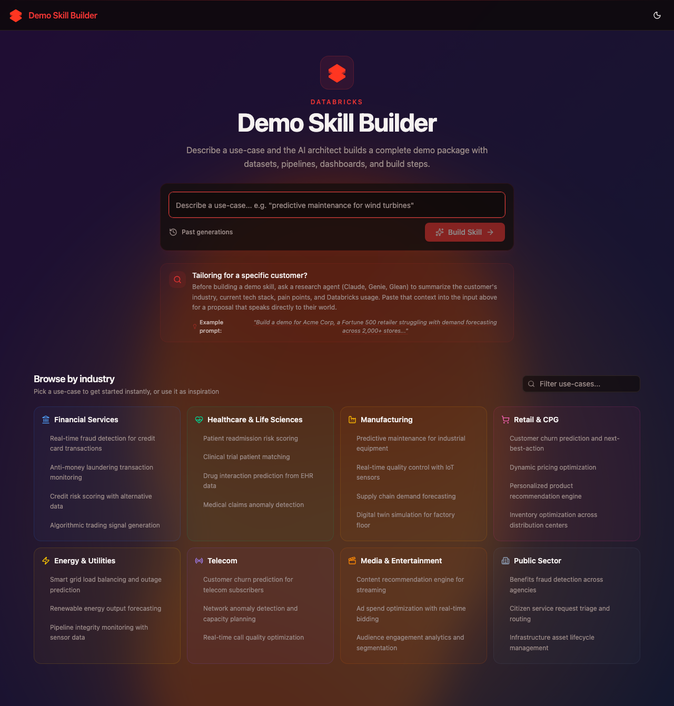
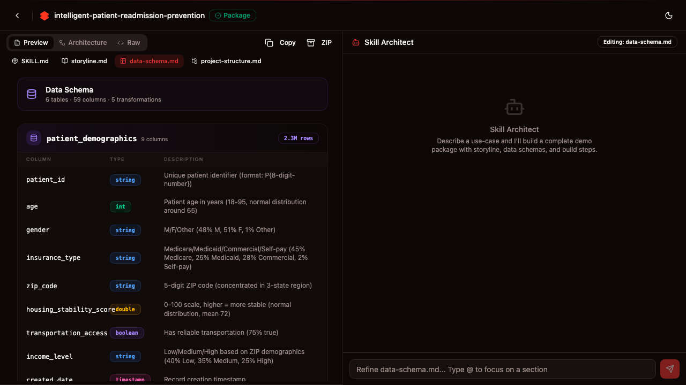

# Industry Demo Prompt Generator

Databricks best practices for 30+ use cases across 8 industry verticals — encoded as **context, not code**. Instead of maintaining static demo repositories that drift out of date, this app captures architectural patterns, data schemas, storylines, and walkthrough scripts as structured knowledge that an LLM can dynamically assemble into a fully personalized demo package for any customer situation.

Describe a customer's industry, pain points, and goals. The app generates a complete instruction set — tailored to that specific scenario — that the [Databricks AI Dev Kit](https://github.com/databricks/ai-dev-kit) can then execute end-to-end to build tables, pipelines, dashboards, Genie spaces, and apps on a live workspace.

Built with [APX](https://github.com/databricks-solutions/apx) (FastAPI + React) and deployed as a Databricks App with Lakebase for persistence.



## Quick start — deploy to Databricks

The entire app deploys as a [Databricks Asset Bundle](https://docs.databricks.com/dev-tools/bundles/index.html) — Lakebase database, Databricks App, and source code in one command.

### Prerequisites

- [APX CLI](https://github.com/databricks-solutions/apx) (`pip install apx`)
- [Databricks CLI](https://docs.databricks.com/dev-tools/cli/index.html) v0.239.0+
- A Databricks workspace with a Foundation Model serving endpoint (default: `databricks-claude-sonnet-4-6`)

### Deploy

```bash
git clone https://github.com/databricks-field-eng/industry-demo-prompts.git
cd industry-demo-prompts/app

# Authenticate with your workspace
databricks auth login --host https://<workspace-url> --profile MY_WORKSPACE

# Deploy (creates Lakebase instance + Databricks App)
databricks bundle deploy -t dev --profile MY_WORKSPACE

# Start the app
databricks bundle run demo-prompt-generator-app -t dev --profile MY_WORKSPACE
```

### Verify

```bash
databricks apps get demo-prompt-gen -p MY_WORKSPACE
# app_status.state should be "RUNNING"
```

The DAB configures `CAN_CONNECT_AND_CREATE` permission on the Lakebase database, so the app's service principal can create tables automatically on first startup. If table creation fails, grant permissions manually:

```bash
databricks psql demo-prompt-gen-db -p MY_WORKSPACE -- \
  -d databricks_postgres \
  -c "GRANT ALL ON SCHEMA public TO PUBLIC; GRANT CREATE ON SCHEMA public TO PUBLIC;"
```

Then restart: `databricks bundle run demo-prompt-generator-app -t dev --profile MY_WORKSPACE`

### Bundle variables

Override per-target or via CLI:

| Variable | Default | Description |
|----------|---------|-------------|
| `llm_endpoint` | `databricks-claude-sonnet-4-6` | Foundation Model serving endpoint for LLM calls |

```bash
# Example: use a different model endpoint
databricks bundle deploy -t dev --var llm_endpoint=databricks-meta-llama-3-3-70b-instruct
```

### Deploy targets

| Target | Mode | Use case |
|--------|------|----------|
| `dev` (default) | `development` | Personal development & testing |
| `prod` | `production` | Shared production deployment |

Add workspace-specific targets by extending `databricks.yml`:

```yaml
targets:
  my-workspace:
    workspace:
      profile: MY_WORKSPACE   # maps to [MY_WORKSPACE] in ~/.databrickscfg
    variables:
      llm_endpoint: "databricks-meta-llama-3-3-70b-instruct"
```

## How it works

The core idea: best practices are captured as context that an LLM uses to generate personalized instructions, rather than as static code templates that need manual adaptation.

1. **Pick a use case** — browse industry verticals (Financial Services, Healthcare, Retail, Manufacturing, Energy, Telecom, Media, Public Sector) or describe your own customer scenario.
2. **Review the proposal** — the app generates a structured proposal personalized to your customer's situation: background, solution approach, datasets, and build steps rendered as visual cards.
3. **Approve & build** — one click generates a 6-file instruction package, each tailored to the specific scenario:
   - `SKILL.md` — build steps, prerequisites, and acceptance criteria (the entry point the AI Dev Kit reads first)
   - `storyline.md` — business narrative, company persona, wow moment, domain glossary
   - `architecture.md` — Mermaid architecture diagram (data assets, compute, apps)
   - `data-schema.md` — table schemas with types, relationships, and transformation SQL
   - `project-structure.md` — target directory layout using Databricks Asset Bundles
   - `walkthrough.md` — step-by-step demo script with navigation cues (also exported as `.docx`)
4. **Refine** — chat with the workspace to iterate on any file. Adjust the storyline for a specific account, swap out data schemas, change the architecture — then download the package as a zip.
5. **Execute** — feed the package to an LLM equipped with the [AI Dev Kit](https://github.com/databricks/ai-dev-kit) to build everything on a live Databricks workspace.



### Library

Pre-built packages for common scenarios are available in the shared library. Fork one as a starting point and personalize it for your customer, rather than starting from scratch.

## Claude Code Skill (standalone)

The demo generator is also available as a standalone Claude Code skill. Install it in any project to generate demo instruction files directly from the command line:

```bash
gh repo clone databricks-field-eng/industry-demo-prompts /tmp/idp && /tmp/idp/install_demo_generator_skill.sh && rm -rf /tmp/idp
```

This installs the `databricks-demo-generator` skill to `.claude/skills/` in your current directory. Then run `claude` and the skill will be available automatically.

**Included reference demos:**
- Financial Services — Fraud Detection (Pacific Coast Bank)
- Healthcare — Patient Readmissions (Meridian Regional Health)
- Manufacturing — Quality Defects (TitanAuto Parts)

## Local development

```bash
cd app
apx dev start     # Start backend + frontend + OpenAPI watcher at http://localhost:9000
apx dev stop      # Stop dev servers
apx dev logs -f   # Stream logs
apx dev check     # TypeScript + Python type checking
apx build         # Production build
```

APX automatically provisions a local PostgreSQL instance — no manual database setup needed. The app resolves Databricks credentials from the SDK (environment variables, `.env` file, or active CLI profile).

## Architecture

### Lakebase tables

| Table | Purpose |
|-------|---------|
| `generation` | Proposals, SKILL.md, package files, stage tracking (`proposal` → `approved` → `package`), starred/library flags |
| `conversation` | Chat threads linked to a generation, with title and timestamps |
| `chat_message` | Individual messages (user, assistant, system) within a conversation |

Tables are auto-created on app startup via SQLModel + DDL migrations in `lakebase.py`.

### API surface

All routes are prefixed with `/api`.

**Workspace (proposal → buildout → refine)**

| Method | Path | Description |
|--------|------|-------------|
| `POST` | `/workspace/propose` | Generate a proposal from a topic (SSE) |
| `POST` | `/workspace/propose/refine` | Refine a proposal via chat (SSE) |
| `POST` | `/workspace/approve` | Approve proposal, transition to buildout |
| `POST` | `/workspace/generate` | Generate SKILL.md from an approved proposal (SSE) |
| `POST` | `/workspace/buildout` | Generate all package files sequentially (SSE) |
| `POST` | `/workspace/buildout-file` | Generate a single package file (SSE) |
| `POST` | `/workspace/buildout-save` | Save a single file to database during buildout |
| `POST` | `/workspace/buildout-finalize` | Save all files to database after buildout |
| `POST` | `/workspace/refine` | Refine the SKILL.md via chat (SSE) |
| `POST` | `/workspace/refine-file` | Refine a single package file via chat (SSE) |
| `POST` | `/workspace/agent-refine` | AI agent-driven refinement of a file (SSE) |
| `GET` | `/workspace/{id}/download` | Download package as zip (includes `.docx` walkthrough) |

**Generations**

| Method | Path | Description |
|--------|------|-------------|
| `GET` | `/generations` | List all past generations |
| `GET` | `/generations/{id}` | Get a single generation |
| `POST` | `/generations/import` | Import a demo package from zip |
| `PATCH` | `/generations/{id}/star` | Toggle starred status |

**Library**

| Method | Path | Description |
|--------|------|-------------|
| `GET` | `/library` | List shared library packages |
| `GET` | `/library/{id}` | Get a library package |
| `POST` | `/library/{id}/fork` | Fork a library package into your generations |

**Conversations**

| Method | Path | Description |
|--------|------|-------------|
| `GET` | `/conversations` | List conversations (optional `?generation_id=` filter) |
| `GET` | `/conversations/{id}` | Get conversation with all messages |
| `POST` | `/conversations/save` | Upsert conversation messages for a generation |
| `DELETE` | `/conversations/{id}` | Delete a conversation |

**Other**

| Method | Path | Description |
|--------|------|-------------|
| `POST` | `/generate` | Generate SKILL.md from structured demo request form |
| `POST` | `/inspire` | Stream an AI-generated use-case description (SSE) |
| `GET` | `/version` | App version |
| `GET` | `/current-user` | Current Databricks user info |

## Project structure

```
industry-demo-prompts/
├── app/
│   ├── databricks.yml                  # DAB config — Lakebase instance + App resource
│   ├── pyproject.toml                  # Python deps + APX metadata
│   ├── package.json                    # Frontend deps
│   └── src/demo_prompt_generator/
│       ├── backend/
│       │   ├── app.py                  # FastAPI entry point
│       │   ├── models.py              # SQLModel tables + Pydantic request/response models
│       │   ├── router.py             # Singleton router, imports all route modules
│       │   ├── core/
│       │   │   ├── _factory.py       # App factory, lifespan, singleton router
│       │   │   ├── _config.py        # AppConfig (host, token, LLM model)
│       │   │   ├── _base.py          # LifespanDependency abstract base class
│       │   │   ├── _defaults.py      # Default dependency implementations
│       │   │   ├── _headers.py       # Databricks Apps HTTP header dependency
│       │   │   ├── _static.py        # Static file serving with caching
│       │   │   ├── dependencies.py   # Dependency type aliases
│       │   │   └── lakebase.py       # DB engine, migrations, session dependency
│       │   ├── routes/
│       │   │   ├── workspace.py       # Proposal, approve, buildout, refine (SSE)
│       │   │   ├── conversations.py   # Conversation CRUD
│       │   │   ├── generations.py     # Generation CRUD, import, star
│       │   │   ├── library.py         # Shared library (list, get, fork)
│       │   │   ├── generate.py        # POST /generate (form → SKILL.md)
│       │   │   └── inspire.py         # POST /inspire (topic → use case)
│       │   └── services/
│       │       ├── skill_generator.py # LLM prompts for proposals + package files
│       │       └── docx_export.py     # Walkthrough → Word document export
│       └── ui/
│           ├── routes/
│           │   ├── index.tsx          # Landing page — industry catalog
│           │   ├── workspace.tsx      # Proposal → build workspace (with auto-save)
│           │   └── _sidebar/
│           │       ├── route.tsx              # Sidebar layout
│           │       ├── generations.tsx        # Layout route
│           │       ├── generations.index.tsx  # Past generations list
│           │       └── generations.$id.tsx    # Generation detail + open in workspace
│           ├── components/
│           │   ├── proposal-cards.tsx         # Structured proposal card renderer
│           │   ├── file-renderers.tsx         # Visual renderers for package files
│           │   └── architecture-builder.tsx   # Interactive Mermaid architecture diagram
│           └── lib/
│               ├── api.ts             # Auto-generated API client (Orval)
│               └── custom-api.ts      # SSE streaming + conversation API helpers
├── tests/                             # Playwright E2E tests
│   ├── e2e-comprehensive.spec.ts
│   ├── workspace.spec.ts
│   ├── library.spec.ts
│   └── ui-changes.spec.ts
├── playwright.config.ts
├── docs/                              # Screenshots
└── .gitignore
```
