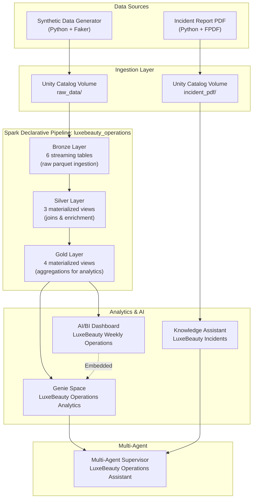

# Architecture

## Architecture Diagram



## Infrastructure

| Resource | Name | Purpose |
|----------|------|---------|
| Catalog | `luxebeauty` | Unity Catalog namespace |
| Schema | `analytics` | All tables and views |
| Volume (raw data) | `/Volumes/luxebeauty/analytics/raw_data/` | Parquet files for pipeline |
| Volume (documents) | `/Volumes/luxebeauty/analytics/raw_data/incident_pdf/` | Incident report PDFs |
| Workspace Folder | `/Workspace/Users/{user}/ai_demos/luxebeauty_demo/` | Pipeline code |

---

## Component 1: Spark Declarative Pipeline

| Setting | Value |
|---------|-------|
| **Pipeline Name** | `luxebeauty_operations` |
| **Catalog** | `luxebeauty` |
| **Target Schema** | `analytics` |
| **Source Volume** | `/Volumes/luxebeauty/analytics/raw_data/` |

### Workspace Folder Structure

```
{workspace_folder}/
├── transformations/
│   ├── 01_bronze_ingestion.py       # Bronze: raw parquet → streaming tables
│   ├── 02_silver_transformation.py  # Silver: joins and enrichment
│   └── 03_gold_aggregation.py       # Gold: aggregations for analytics
└── exploration/
    └── exploration_notebook.py      # Verify raw data after upload
```

### Exploration Notebook

Before running the pipeline, create an exploration notebook to verify raw data:
1. List the volume folder in SQL: `LIST '{volume_path}'`
2. Preview each parquet file with `SELECT * FROM parquet.\`{volume_path}/{file}\` LIMIT 10`
3. A simple join/aggregation to check returns by lot — exploratory EDA with a brief comment

### Bronze Layer (01_bronze_ingestion.py)

Ingest parquet files as streaming tables:

| Table | Source | Purpose |
|-------|--------|---------|
| `bronze_customers` | customers.parquet | Raw customer records |
| `bronze_products` | products.parquet | Raw product catalog |
| `bronze_production_lots` | production_lots.parquet | Raw lot records |
| `bronze_orders` | orders.parquet | Raw order headers |
| `bronze_order_items` | order_items.parquet | Raw line items |
| `bronze_returns` | returns.parquet | Raw return records |

### Silver Layer (02_silver_transformation.py)

Create materialized views that join and enrich:

| Table | What It Contains | Why It Matters |
|-------|------------------|----------------|
| `silver_orders` | Orders + customer info (region, loyalty tier) | Enables regional analysis |
| `silver_order_items` | Order items + product info + lot info | **Key for traceability**: links items → lots → products |
| `silver_returns` | Returns + order item + product + lot context | Enables "which lot caused these returns" analysis |

**Key columns for silver_order_items**: order_id, order_date, customer region, product_id, product_name, category, lot_id, production_date, facility

**Key columns for silver_returns**: return_id, order_item_id, product info, lot_id, return_date, refund_amount, return_reason, return_reason_text, days_to_return

### Gold Layer (03_gold_aggregation.py)

Create aggregated tables for dashboard and Genie:

| Table | What It Contains | Why It Matters |
|-------|------------------|----------------|
| `gold_daily_orders` | Daily aggregations by region and category | Dashboard revenue charts |
| `gold_daily_returns` | Daily returns by region, category, lot, product | Dashboard returns charts, spike visibility |
| `gold_weekly_summary` | Weekly KPIs: revenue, items sold, returns, return rate | **Dashboard KPI cards — the ~$180K spike** |
| `gold_returns_by_lot` | Returns by lot_id with customer feedback samples | **Genie's "which lot" analysis** |

**Key columns for gold_returns_by_lot**: lot_id, production_date, product_id, product_name, category, return_count, total_refund_usd, avg_days_to_return, customer_feedback_samples (collected return_reason_text values)

### Pipeline Validation

After the pipeline runs, verify:

| Table | What to Verify |
|-------|----------------|
| bronze_* tables | Row counts match source parquet files |
| silver_returns | Contains lot_id column, can filter by LOT-2025-0212 |
| gold_weekly_summary | Week of Mar 17 shows ~$180K returns (vs ~$60K normal weeks) |
| gold_returns_by_lot | LOT-2025-0212 shows ~720 returns across 3 products |
| gold_returns_by_lot | customer_feedback_samples contains texture complaints |

**If validation fails**: Check bronze tables first (data generation issue) vs silver/gold (transformation issue). Fix the root cause, re-run pipeline with full refresh, re-validate.

---

## Component 2: AI/BI Dashboard

| Setting | Value |
|---------|-------|
| **Dashboard Name** | `LuxeBeauty Weekly Operations` |
| **Catalog/Schema** | `luxebeauty.analytics` |

### The Visual Story

The dashboard tells a story at a glance: everything looks normal **except** returns. This visual contrast triggers Claire's question.

**Critical**: The spike must be immediately obvious — not subtle. If someone has to study the dashboard to notice something is wrong, the demo fails. (5-second test.)

### Date Handling

The data uses fixed dates (Feb–Mar 2025). Dashboard queries must:
- Reference the spike week directly (week of March 17, 2025) for KPIs
- Show ~8 weeks of history for trend charts
- **NOT** use `CURRENT_DATE()` — use fixed date ranges so the spike is always visible

### Layout

```
┌─────────────────────────────────────────────────────────────────────────────┐
│  HEADER: LuxeBeauty Weekly Operations                                       │
├─────────────────────────────────────────────────────────────────────────────┤
│  FILTERS: Region (US, EU, APAC) — multi-select dropdown                     │
├─────────────────────────────────────────────────────────────────────────────┤
│  KPI CARDS (4 counters)                                                     │
│  ┌──────────┐  ┌──────────┐  ┌──────────┐  ┌──────────┐                    │
│  │ Revenue  │  │ Orders   │  │ Items    │  │ Returns  │ ← THE SPIKE        │
│  │ ~$3.8M   │  │ ~924     │  │ ~1,450   │  │ ~$180K   │                    │
│  └──────────┘  └──────────┘  └──────────┘  └──────────┘                    │
├─────────────────────────────────────────────────────────────────────────────┤
│  WEEKLY TREND (full width) — Combo chart                                    │
│  Revenue bars + Returns line → spike visible in most recent week            │
├─────────────────────────────────────────────────────────────────────────────┤
│  ┌──────────────────────┐  ┌──────────────────────┐                        │
│  │ Revenue by Category  │  │ Daily Returns        │                        │
│  │ (Pie Chart)          │  │ (Bar Chart)          │                        │
│  └──────────────────────┘  └──────────────────────┘                        │
├─────────────────────────────────────────────────────────────────────────────┤
│  TOP PRODUCTS TABLE (full width)                                            │
│  Product | Category | Units | Revenue | Returns | Return Rate               │
│  3 Skincare products with ~30% return rate standing out                    │
├─────────────────────────────────────────────────────────────────────────────┤
│  GENIE SPACE (embedded) — "Ask a question about this data"                  │
└─────────────────────────────────────────────────────────────────────────────┘
```

### KPI Cards

| KPI | Source | Expected Value | Notes |
|-----|--------|----------------|-------|
| Weekly Revenue | gold_weekly_summary | ~$3.8M | Normal — provides contrast |
| Weekly Orders | gold_weekly_summary | ~924 | Normal — provides contrast |
| Items Sold | gold_weekly_summary | ~1,450 | Normal — provides contrast |
| **Weekly Returns** | gold_weekly_summary | **~$180K** | **THE SPIKE — 3x normal** |

### Weekly Trend Chart (Combo)

| Element | Configuration |
|---------|---------------|
| Chart type | Combo (bar + line) |
| X-Axis | week_start (temporal) |
| Bars (primary) | total_revenue — shows steady business |
| Line (secondary) | total_returns_usd — shows the spike |
| Source | gold_weekly_summary, ~8 weeks |

### Revenue by Category (Pie Chart)

| Element | Configuration |
|---------|---------------|
| Chart type | Pie |
| Angle | Revenue amount |
| Color | Category (Skincare, Makeup, Haircare) |
| Source | gold_daily_orders aggregated by category |
| Time range | Spike week |

### Daily Returns This Week (Bar Chart)

| Element | Configuration |
|---------|---------------|
| Chart type | Bar |
| X-Axis | return_date (temporal, daily) |
| Y-Axis | Return amount or count |
| Source | gold_daily_returns |
| Time range | Spike week only |

### Top Products Table

| Column | Source | Notes |
|--------|--------|-------|
| Product Name | products/order_items | Human-readable name |
| Category | products | Skincare, Makeup, etc. |
| Units Sold | order_items aggregated | Count |
| Revenue | order_items aggregated | Sum of line totals |
| Returns | returns aggregated | Sum of refund amounts |
| Return Rate | Calculated | Returns / units as % |

Limit to top 10–15 products by revenue. The 3 affected products (SKU-1001, SKU-1002, SKU-1003) should show ~30% return rates vs ~8% for others. Consider conditional formatting to highlight return rates > 20%.

### Genie Space Integration

Embed the Genie Space into the dashboard so Claire can ask questions directly when she sees the spike. Use the Genie Space ID from step 6.

### Dashboard Validation

| Check | What to Look For |
|-------|------------------|
| **Spike is obvious** | Can you immediately see something is wrong without studying? |
| **Returns KPI** | Shows ~$180K — clearly higher than ~$60K |
| **Trend chart** | Clear spike in returns line for most recent week |
| **Products table** | SKU-1001, SKU-1002, SKU-1003 have ~30% return rates |
| **Contrast works** | Revenue, orders look normal — returns stands out |

---

## Component 3: Genie Space

| Setting | Value |
|---------|-------|
| **Space Name** | `LuxeBeauty Operations Analytics` |
| **Description** | "Ask questions about customer orders, returns, product performance, and production lots. Great for investigating operational anomalies." |
| **Catalog/Schema** | `luxebeauty.analytics` |

### Tables to Include

| Table | Purpose |
|-------|---------|
| `gold_weekly_summary` | Weekly KPIs and trends |
| `gold_daily_orders` | Daily sales by date/region/category |
| `gold_daily_returns` | Daily returns with lot context |
| `gold_returns_by_lot` | Lot-level return analysis |
| `silver_orders` | Order details |
| `silver_order_items` | Item-level with lot traceability |
| `silver_returns` | Returns with customer feedback |
| `bronze_products` | Product catalog |
| `bronze_production_lots` | Production lot records |

### Genie Instructions

```
You are an operations analyst for LuxeBeauty Co., a cosmetics company.

## AUTOMATIC DEEP ANALYSIS

When someone asks a general question like "Why do I have so many returns?" or "What's happening with returns?", you should AUTOMATICALLY:

1. COMPARE to baseline: Look at recent weeks vs historical average
   - Normal weekly returns: ~$60K
   - If current week is significantly higher, quantify the difference (e.g., "3x higher than normal")

2. IDENTIFY affected products: Query gold_daily_returns and gold_returns_by_lot
   - List the top products by return count/value
   - Calculate what % of total returns they represent

3. FIND the common factor: Look for patterns
   - Do affected products share a lot_id?
   - When was that lot produced?
   - What facility produced it?

4. ANALYZE customer feedback: Query silver_returns for return_reason_text
   - What are customers actually saying?
   - Are there common themes (texture, smell, consistency)?

5. PROVIDE a summary with:
   - The anomaly: "Returns are X times higher than normal"
   - The products: "3 Skincare products account for Y% of returns"
   - The lot: "All trace to lot LOT-XXXX produced on [date]"
   - The feedback: "Customers report [common themes]"
   - Suggested next step: "Check if there's an incident report for this lot"

## KEY DOMAIN KNOWLEDGE

- Normal return rate: ~8% across products
- Normal weekly returns: ~$60K
- A return rate above 20% for any product is unusual
- Multiple products sharing the same lot_id with high returns suggests a manufacturing issue
- Texture complaints (grainy, separated, lumpy) often indicate emulsification problems
- The lot_id format is LOT-YYYY-MMDD (e.g., LOT-2025-0212 = February 12, 2025)

## RESPONSE FORMAT

Always provide:
- Specific numbers (counts, percentages, dollar amounts)
- Reference specific lot IDs and product names
- Highlight anomalies compared to baseline
- Connect the dots (products → lot → production date)
- End with a clear summary and suggested action
```

### Sample Questions

| Question | Expected Behavior |
|----------|-------------------|
| "Why do I have so many returns?" | **Primary demo question.** Comprehensive analysis → identifies LOT-2025-0212 |
| "What's happening with returns this week?" | Weekly comparison, identifies spike |
| "Which products have the highest returns?" | Lists SKU-1001, SKU-1002, SKU-1003 with rates |
| "Tell me about lot LOT-2025-0212" | Lot details, return count, feedback samples |
| "What are customers saying about returns?" | Texture complaints grouped by theme |
| "Show me weekly returns for the last 8 weeks" | Trend showing flat then spike |

### Question/Guideline Pairs

| Question | Guideline |
|----------|-----------|
| "Why do I have so many returns?" | Perform comprehensive analysis: compare to baseline, identify top products, find common lot_id, analyze customer feedback, summarize and suggest checking incident reports |
| "Which products have issues?" | Query gold_returns_by_lot for products with return rate > 20%, list with lot_id |
| "What are customers complaining about?" | Query silver_returns.return_reason_text, group by common themes |
| "Tell me about lot LOT-2025-0212" | Query gold_returns_by_lot and silver_returns for this lot, show products, return count, customer feedback |

---

## Component 4: Knowledge Assistant

| Setting | Value |
|---------|-------|
| **KA Name** | `LuxeBeauty Incidents` |
| **Description** | "Search production incident reports and quality documentation for LuxeBeauty Co." |
| **Volume Path** | `/Volumes/luxebeauty/analytics/raw_data/incident_pdf/` |

The KA indexes all PDF documents from this folder (~10 documents total: 9 background + 1 key incident report).

### KA Instructions

```
You are a knowledge assistant for LuxeBeauty Co.'s production incident reports.

## RESPONSE REQUIREMENTS

When answering questions:
1. Always cite the specific document name and report number (e.g., "PIR-2025-0212")
2. Quote relevant passages directly when they contain key information
3. Include dates, lot numbers, and product SKUs when they appear
4. Connect the incident details to the business impact when relevant

## KEY RESPONSE PATTERN

When asked about texture issues or lot LOT-2025-0212:
1. Reference the incident report PIR-2025-0212
2. Quote the QC note about "texture variations due to pressure fluctuations during emulsification"
3. Mention the disposition was "RELEASE FOR DISTRIBUTION"
4. Connect to the root cause: homogenizer pressure issues
```

### Sample Questions

| Question | Expected Behavior |
|----------|-------------------|
| "Was there any incident reported for lot LOT-2025-0212?" | **Primary demo question.** Finds PIR-2025-0212, summarizes pressure issue |
| "What caused the texture problems?" | Pressure fluctuations during emulsification |
| "Was the lot released despite the issue?" | Yes — RELEASE FOR DISTRIBUTION, visual QC passed |
| "Which products were affected by the incident?" | SKU-1001, SKU-1002, SKU-1003 (2,400 units) |
| "What equipment had issues at the Lyon facility?" | Homogenizer HMG-03, pressure gauge fluctuations |

### Question/Guideline Pairs

| Question | Guideline |
|----------|-----------|
| "Was there any incident for lot LOT-2025-0212?" | Search for production incident reports, cite PIR-2025-0212, include QC note about texture |
| "What caused the texture problems?" | Find the homogenizer pressure issue, quote the QC assessment about emulsification |
| "Was the lot released?" | Find disposition section, state RELEASE FOR DISTRIBUTION and the rationale |
| "Which products were affected?" | List SKU-1001, SKU-1002, SKU-1003 with quantities |
| "What happened at the Lyon facility?" | Reference HMG-03 homogenizer, pressure gauge fluctuations, calibration drift |

---

## Component 5: Multi-Agent Supervisor

| Setting | Value |
|---------|-------|
| **MAS Name** | `LuxeBeauty Operations Assistant` |
| **Description** | "Your intelligent assistant for investigating operational issues. Ask about returns, product performance, quality incidents, and get comprehensive analysis." |

### Agent Configuration

**Agent 1: Operations Data Analyst (Genie)**

| Setting | Value |
|---------|-------|
| Name | `data_analyst` |
| Type | Genie Space |
| Genie Space | `LuxeBeauty Operations Analytics` |
| Description | "Analyzes operational data — orders, returns, products, production lots. Answers WHAT happened with specific numbers and lot IDs." |

Routes to this agent for: questions about returns, orders, revenue, products, lots, trends, comparisons, customer feedback, questions starting with "why" about operations.

**Agent 2: Incident Documentation Expert (KA)**

| Setting | Value |
|---------|-------|
| Name | `incident_expert` |
| Type | Knowledge Assistant |
| KA | `LuxeBeauty Incidents` |
| Description | "Searches production incident reports and quality documentation. Answers questions about documented incidents and manufacturing issues." |

Routes to this agent for: questions about incidents, specific lot IDs in incident context, production issues, manufacturing problems, equipment issues.

### MAS Instructions

```
You are the LuxeBeauty Operations Assistant, helping investigate operational issues.

## YOUR AGENTS

1. DATA ANALYST (Genie): For operational data
   - Return statistics and trends
   - Product performance and return rates
   - Production lot analysis
   - Customer feedback from returns data

2. INCIDENT EXPERT (KA): For incident documentation
   - Production incident reports
   - Equipment issues
   - Quality incidents
   - Manufacturing problems

## ROUTING LOGIC

### For general operations questions → Route to DATA ANALYST first:
- "Why do I have so many returns?"
- "What's happening with returns this week?"
- "Which products have issues?"
- "What are customers saying?"

### For incident/documentation questions → Route to INCIDENT EXPERT:
- "Was there any incident for lot LOT-2025-0212?"
- "What happened during production of this lot?"
- "Any manufacturing issues reported?"
- "What caused the texture problems?"

## SYNTHESIS PATTERN

When the DATA ANALYST identifies a problematic lot (e.g., LOT-2025-0212),
ALWAYS suggest checking incident documentation:

"The data shows that lot LOT-2025-0212 is the common factor. Would you like
me to check if there were any production incidents reported for this lot?"

When providing final answers that combine both sources:
- Lead with the data findings (what happened)
- Follow with the documentation findings (why it happened)
- Connect the dots for the user
```

### Demo Flow Questions

| Step | Question | Routes To | Expected Result |
|------|----------|-----------|-----------------|
| 1 | "Why do I have so many returns?" | data_analyst | Identifies LOT-2025-0212, texture complaints |
| 2 | "Was there any incident reported for lot LOT-2025-0212?" | incident_expert | Finds PIR-2025-0212, pressure issue |

### Question/Guideline Pairs

```json
[
  {
    "question": "Why do I have so many returns?",
    "guideline": "Route to data_analyst. The Genie has smart instructions to automatically perform deep analysis and identify the problematic lot."
  },
  {
    "question": "Was there any incident reported for lot LOT-2025-0212?",
    "guideline": "Route to incident_expert. Search for production incident reports mentioning this lot ID."
  },
  {
    "question": "What caused the texture problems?",
    "guideline": "Route to incident_expert. Find documentation explaining the manufacturing issue with the homogenizer."
  },
  {
    "question": "Which products have the highest returns?",
    "guideline": "Route to data_analyst for product return analysis from the operational data."
  },
  {
    "question": "What are customers saying about the products?",
    "guideline": "Route to data_analyst. Query return feedback data for customer complaints."
  },
  {
    "question": "What happened during production?",
    "guideline": "Route to incident_expert. Search production incident reports for manufacturing details."
  }
]
```

### MAS Validation

| Step | Question | Expected Result |
|------|----------|-----------------|
| 1 | "Why do I have so many returns?" | Routes to Genie, identifies LOT-2025-0212 |
| 2 | "Was there an incident for that lot?" | Routes to KA, finds PIR-2025-0212 |
| 3 | "What caused it?" | Routes to KA, explains pressure fluctuation |
